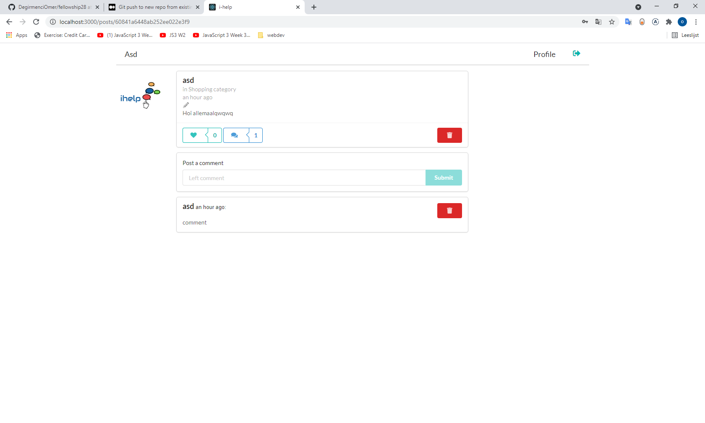
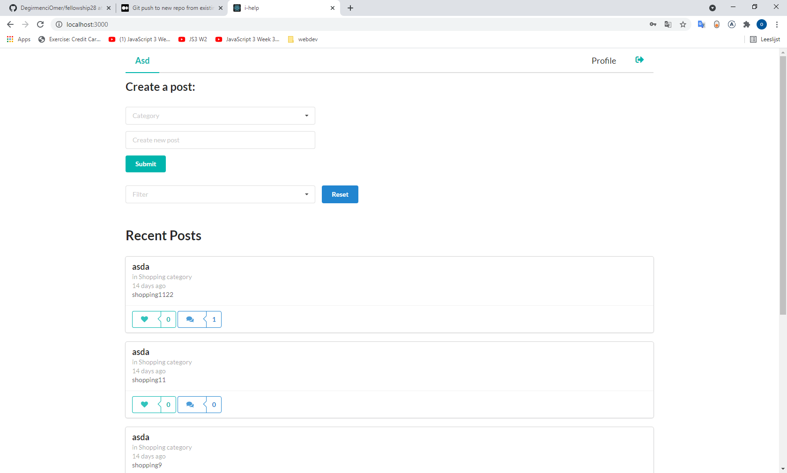
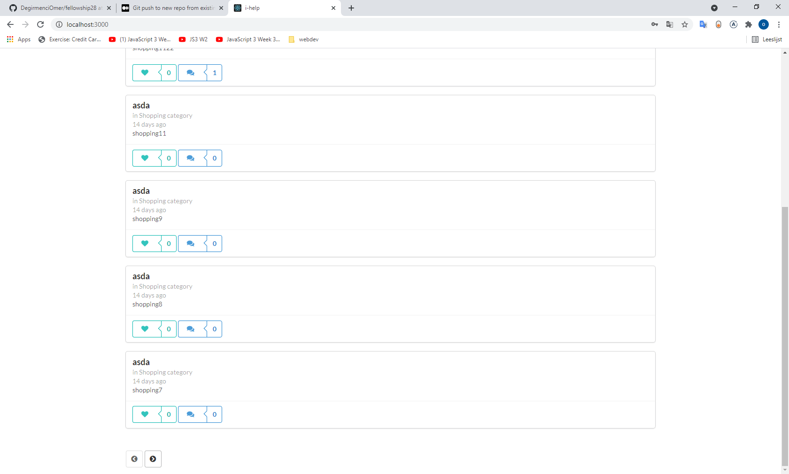
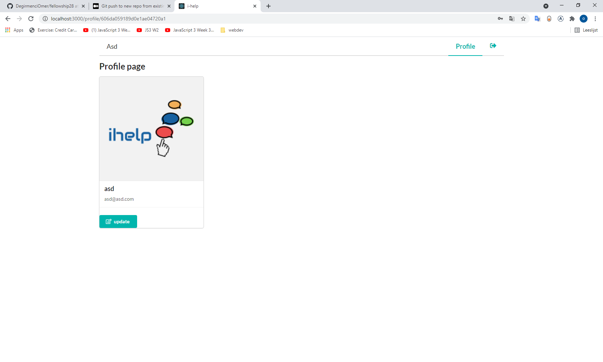

# HYF fellowship28 Project: i-help

- A social media app using GraphQl.
- This project was forked from the [Fellowship28 project](https://github.com/DegirmenciOmer/fellowship28/tree/development).
- Working site : https://hopeful-hamilton-2ac184.netlify.app/

## Table of contents

- [Table of contents](#table-of-contents)
- [General info](#general-info)
- [Technologies](#technologies)
- [Features](#features)
- [Screenshots](#screenshots)

## General info

This project is aimed to build a social media app which is intended to create a platform where people meet

- to help people as a volunteer in need of help,
- to ask for help
  n diverse categories.

The code base is available [here](https://www.udemy.com/the-web-developer-bootcamp).

## Technologies

Frontend:

- React
- Apollo Client
- Semantic UI

Backend:

- NodeJS
- GraphQl
- MongoDB
- Mongoose
- JWT
- Apollo Server

# Clone this repository

\$ git clone https://github.com/DegirmenciOmer/fellowship28.git

## Features

- Crate an account
- Submit a post
- Update post
- Delete post
- Like post
- Comment on post
- Profile settings
- Pagination
- See the posts without registering.

## Screenshots

 
